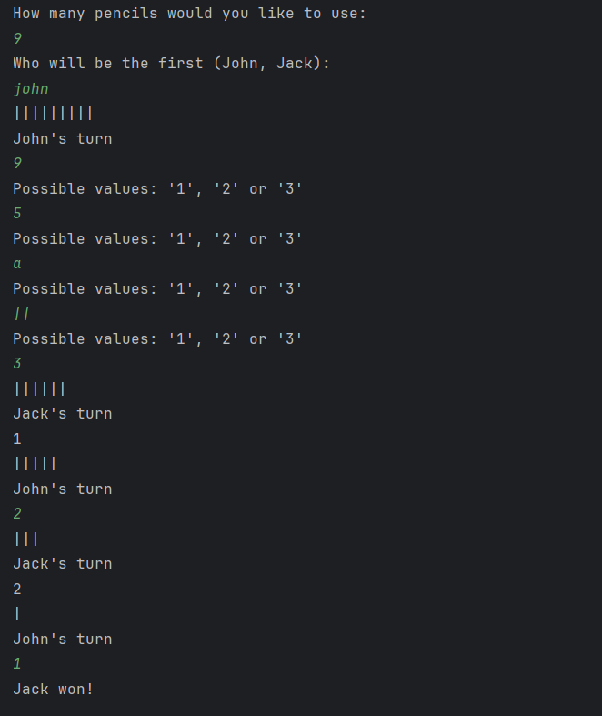

# Hyperskill-Last-Pencil-Game
A project as part of the Hyperskill Java certification, where we are given a prompt to make a game where two players are playing "Pick-up-sticks" with pencils, and build it from scratch. 

It is a simple text based game, designed to emulate a "Pick-up-sticks" game between a bot "Jack" and the player "John". Jack the bot will make decisions to win the game based on remaining Pencils. Jack computes the best move based on a modulus computation of the remaining pencils. The game runs entirely in console. 

You can view the source code in either LastPencilGame.java or download the "LastPencilGame" file for intellij for easy viewing.  

Example of finished version running: 

  

This code is not intended for sale and should not be used for such purposes.
